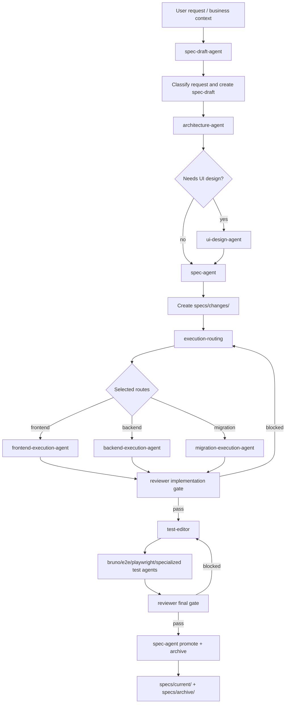

# Agents

This directory defines local agent routing, role contracts, and scoped skill
loading for the cycling-agent repository.

## How To Use

- Start with `manifest.yaml` to choose the correct agent role.
- Resolve `role_prompt` paths relative to `.agents/`; resolve `canonical`, `skills[*].path`, and `context_includes` from the repository root unless noted otherwise.
- After selecting a role, only load that role's declared `role_prompt`, `canonical`, `skills`, and `context_includes`.
- Use `roles/` for local role-specific responsibilities, inputs, outputs, and guardrails.
- Keep role outputs aligned with canonical assets under `ai/agents/`.
- Prefer assigning one role per bounded task.

## Role Selection

- Request intake and draft shaping: `spec-draft-agent`
- Architecture and route selection: `architecture-agent`
- Product UI design: `ui-design-agent`
- Change package normalization, promote, archive: `spec-agent`
- Frontend execution: `frontend-execution-agent`
- Backend execution: `backend-execution-agent`
- Local backend/frontend startup and health checks: `local-dev-runtime-agent`
- Migration execution: `migration-execution-agent`
- Domain specialist support: `ddd-domain-agent`
- API contract generation: `openapi-agent`
- Independent test planning: `test-editor`
- API scenario tests: `bruno-test-agent`
- End-to-end business journeys: `e2e-test-agent`
- UI scenario tests: `playwright-test-agent`
- CI and release gates: `ci-editor`
- Local scripts and workflow wiring: `execution-editor`
- Implementation and final review gates: `reviewer`

## Dispatch Flow

The default entry agent receives the user request, classifies the work, then routes bounded tasks to the narrowest matching role from `manifest.yaml`. This is a routing contract for agent teams; the current repository stores the contract and role prompts, while concrete runtime dispatch is implemented by the host agent system or future workflow runner.

## Prompt Assembly

When a role is selected, assemble prompt context in this order:

1. Root `AGENTS.md`
2. `.codex/instructions.md`
3. Selected role metadata from `manifest.yaml`
4. Selected `role_prompt`
5. Selected canonical file under `ai/agents/`
6. Selected declared skills
7. Selected required rules and context includes

## Project Context Placement

Stable project background, architecture facts, and domain language belong under `specs/current/`:

- `specs/current/project-context.md`
- `specs/current/architecture-context.md`
- `specs/current/domain-context.md`

Lifecycle evidence for one request belongs under `specs/changes/<change-id>/`:

- `spec.md`
- `architecture-review.md`
- `design-review.md` or `not-applicable`
- `execution-plan.md`
- `routing-summary.json`
- `implementation-report.frontend.md`
- `implementation-report.backend.md`
- `implementation-report.migration.md`
- `review-report.implementation.md`
- `review-report.final.md`
- `test-result-summary.md`
- `changelog.md`

Role prompts should reference these files through `.agents/manifest.yaml` `context_includes` instead of duplicating accepted project facts inside `.agents/roles/` or `ai/agents/`.

## Skill Loading Rules

- Skills are opt-in per role and must be declared in `manifest.yaml`.
- Do not preload repository-local or external skills for unrelated roles.
- If a role has `skills: []`, run it with role docs and rules only.
- For cross-domain work, switch agents or split the task instead of broadening one agent's context.

## Shared Rules

- Every role must cite the current spec, proposed change, draft, rule, or workflow it is using.
- Every output must include open questions when information is missing.
- Role work should be narrow, reviewable, and safe to compose with other agents.
