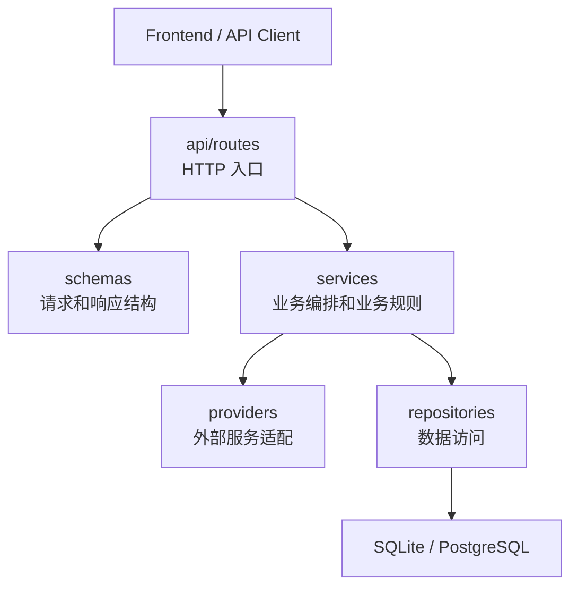
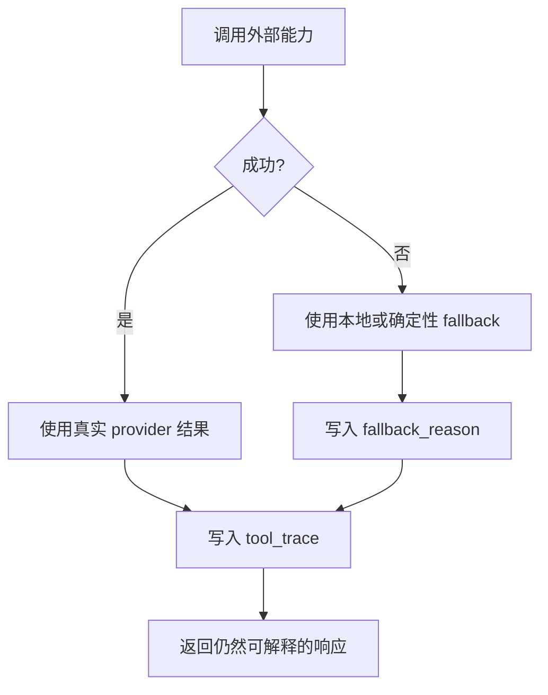
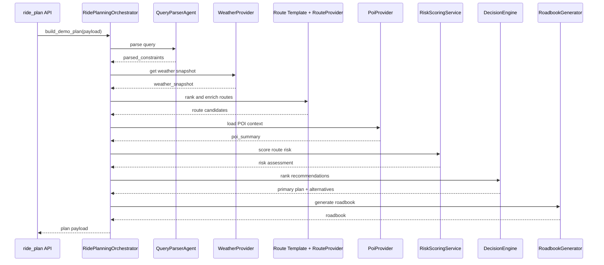
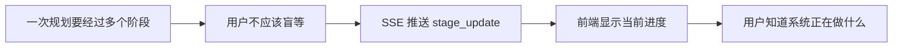
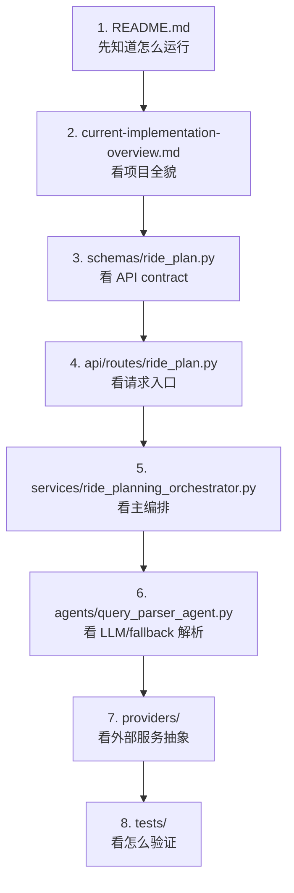

# Backend to AI Agent Tutorial for Beginners

Traceability:

- Product source: `../../../docs/product/02-prd-mvp.md`
- Technical source: `../../../docs/technical/03-technical-architecture.md`, `../../../docs/technical/04-technical-spec.md`
- Current implementation source: `./current-implementation-overview.md`
- Code root: `../`

这是一份面向后端开发者的入门教程。目标不是把 AI 和 Agent 讲成抽象概念，而是用当前杭州骑行助手项目，把你熟悉的 API、service、repository、provider、schema 和测试，一步步映射到 AI 应用开发和 Agent 开发里。

读完后，你应该能回答三个问题：

1. 这个项目和普通后端项目有什么相同点。
2. AI 应用多出来的 Agent、LLM、tool trace、fallback 是什么。
3. 如果你要从后端转向 AI Agent 开发，应该从哪些文件开始读、改、测。

## 1. 先用一张图看懂项目

这个 MVP 是一个杭州 AI 骑行决策 Agent。用户输入一句自然语言，比如：

```text
明天从滨江出发，想骑 3 小时，轻松一点，尽量少爬坡
```

系统会把这句话变成结构化约束，然后结合路线模板、天气、补给点、风险规则，给出推荐路线和解释型路书。

图 1：一次请求的主链路

```mermaid
flowchart LR
  U["用户自然语言需求"] --> API["FastAPI: /api/v1/ride/plan"]
  API --> O["RidePlanningOrchestrator"]
  O --> Q["QueryParserAgent<br/>解析自然语言"]
  Q --> R["RoutePlanner<br/>匹配路线模板"]
  R --> W["WeatherProvider<br/>天气事实"]
  W --> P["PoiProvider<br/>补给与撤退点"]
  P --> Risk["RiskEvaluator<br/>确定性风险评分"]
  Risk --> D["DecisionEngine<br/>确定性推荐排序"]
  D --> B["RoadbookGeneratorAgent<br/>生成解释型路书"]
  B --> Res["API Response<br/>推荐路线 + 风险 + tool_trace"]
```



这里最重要的一点是：它不是一个让大模型自由决定一切的系统。MVP 采用受控编排：

- `QueryParserAgent` 可以使用 LLM，把用户输入解析成 JSON。
- `RoadbookGeneratorAgent` 可以使用 LLM，把结构化结果写成自然中文。
- `RoutePlanner`、`RiskEvaluator`、`DecisionEngine` 保持确定性，不让 LLM 随便改路线事实、风险分和最终排序。

这就是后端转 Agent 开发时最关键的思维变化：不要只问“怎么调用大模型”，而要问“哪些步骤适合 LLM，哪些步骤必须由可测试、可审计的后端逻辑控制”。

## 2. 你已经熟悉的后端部分

先把这个项目当成一个普通后端应用来看。

图 2：后端开发者熟悉的分层



对应到当前文件：

| 后端概念 | 当前文件 | 你应该怎么看 |
| --- | --- | --- |
| 应用入口 | `../backend/app/main.py` | 创建 FastAPI app，初始化配置、存储、provider 和路由 |
| API 路由 | `../backend/app/api/routes/ride_plan.py` | 提供同步规划、SSE 流式规划、历史结果读取 |
| 请求响应 schema | `../backend/app/schemas/ride_plan.py` | 固定 API contract，避免前后端靠口头约定 |
| 业务编排 | `../backend/app/services/ride_planning_orchestrator.py` | 一次规划请求的主流程 |
| 业务规则 | `../backend/app/services/risk_scoring_service.py` | 风险评分规则，确定性、可测试 |
| 外部服务 | `../backend/app/providers/` | 天气、路线、POI、LLM 的统一适配层 |
| 数据访问 | `../backend/app/repositories/` | 保存规划结果、审计记录、查询日志和配置 |
| 种子数据 | `../data/hangzhou_routes.json` | 杭州路线模板库 |

如果你做过 Spring Boot、Go HTTP service、FastAPI 或 NestJS，这一层应该很熟悉。AI Agent 不是替代这些后端工程能力，而是在这些能力上增加“语言理解、工具调用、解释生成和可观测追踪”。

## 3. AI 应用多出来的四个概念

### 3.1 LLM Agent

在这个项目里，Agent 不是神秘东西，可以先理解成“带有明确职责和约束的 LLM 调用单元”。

当前 MVP 只有两个 LLM Agent：

| Agent | 文件/位置 | 职责 | 禁止做什么 |
| --- | --- | --- | --- |
| `QueryParserAgent` | `../backend/app/agents/query_parser_agent.py` | 把自然语言解析成结构化约束 | 不推荐路线、不编造天气或路线事实 |
| `RoadbookGeneratorAgent` | 通过 `llm_provider.generate_roadbook()` 或模板路书实现 | 把结构化决策结果写成用户能读懂的路书 | 不修改路线、风险等级、距离、时长和推荐结论 |

图 3：Agent 只处理适合语言模型的部分


你可以把它和传统后端中的 parser、formatter 类比：

- parser 把外部输入转成内部结构。
- formatter 把内部结构转成用户友好的输出。
- 只是这里的 parser 和 formatter 可以由 LLM 辅助完成。

### 3.2 Tool / Provider

很多 Agent 教程会说“让 Agent 调工具”。在工程里，工具不能裸奔，应该被封装成 provider。

当前 provider 包括：

- `weather_provider.py`: 获取或兜底天气。
- `route_provider.py`: 路线/地图上下文，默认本地，可切高德。
- `poi_provider.py`: 补给点、撤退点等 POI 上下文。
- `llm_provider.py`: OpenAI-compatible LLM 接入。

后端开发者可以这样理解：

```text
外部 API / SDK / MCP
-> provider 归一化
-> service 使用稳定结构
-> schema 返回给前端
```

这样做的好处是，外部服务变了，核心业务流程不需要跟着乱。

### 3.3 Fallback

AI 应用不能假设所有外部能力永远可用。LLM、天气、高德、Redis、网络都可能失败。

当前项目的设计是“可接入、默认降级”：

- 没有 LLM 时，`QueryParserAgent` 使用 deterministic fallback parser。
- 没有 LLM 时，路书使用模板生成。
- 天气失败时，返回 fallback weather snapshot。
- 路线/POI provider 失败时，继续使用本地路线模板事实。
- Redis 没配置时，使用进程内缓存。

图 4：fallback 让系统保持可用



对新手来说，这一点非常重要：AI 应用不是 demo 成功就结束，真正工程化要回答“失败时用户看到什么、日志里怎么追踪、测试怎么覆盖”。

### 3.4 Trace / Audit

普通后端会记录日志。Agent 应用还需要记录“每个阶段做了什么，使用了哪个 provider，是否降级”。

当前响应里有两个关键字段：

| 字段 | 含义 |
| --- | --- |
| `tool_trace[]` | 阶段执行轨迹，例如 `query_parser`、`weather_provider`、`risk_evaluator` |
| `fallback_reason[]` | 降级原因，例如 `weather-provider-missing`、`llm-roadbook-missing` |

这让你可以回答：

- 推荐结果为什么这样来？
- 大模型有没有参与？
- 天气服务是否失败？
- 风险评分是哪个阶段给出的？
- SSE 页面为什么显示某个阶段已完成？

这也是 Agent 应用和普通聊天机器人的区别：它不是只返回一句话，而是返回可追踪的决策过程。

## 4. 跟着一次请求走一遍

下面用同步接口 `POST /api/v1/ride/plan` 看完整流程。

### 第一步：API 收到请求

入口在 `../backend/app/api/routes/ride_plan.py`：

```text
POST /api/v1/ride/plan
-> create_ride_plan()
-> _resolve_cached_plan()
-> build_demo_plan()
-> _persist_plan_payload()
-> RidePlanResponseSchema
```

请求结构由 `RidePlanRequestSchema` 固定：

```json
{
  "query": "明天从滨江出发，想骑 3 小时，轻松一点，尽量少爬坡",
  "target_date": "2026-05-31",
  "city_code": "hangzhou",
  "user_profile": {
    "fitness_level": "medium",
    "slope_tolerance": "avoid"
  }
}
```

后端开发者要注意：`query` 是自然语言，但进入主流程后必须尽快变成结构化数据，否则后续规则无法稳定测试。

### 第二步：Orchestrator 接管流程

核心文件是 `../backend/app/services/ride_planning_orchestrator.py`。

图 5：编排器内部流程



这里的 `RidePlanningOrchestrator` 像一个后端 workflow service。它自己不应该“拍脑袋推荐路线”，而是按顺序调用每个 stage，并收集结果。

### 第三步：解析自然语言

输入：

```text
明天从滨江出发，想骑 3 小时，轻松一点，尽量少爬坡
```

期望的结构化结果类似：

```json
{
  "origin_region": "滨江",
  "available_hours": 3,
  "target_distance_km": null,
  "ride_style": "scenic_relaxed",
  "fitness_level": "medium",
  "slope_tolerance": "avoid",
  "missing_fields": [],
  "confidence": 0.91
}
```

这一步适合 LLM，因为人类自然语言表达很多变。但它也必须有 fallback，因为没有 LLM key 时项目仍然要能跑。

### 第四步：路线、天气、POI 都变成事实

后续阶段不要让 LLM 编造事实。

路线来自：

- `../data/hangzhou_routes.json`
- `route_provider.py` 可选地图增强

天气来自：

- `weather_provider.py`
- 失败时 fallback snapshot

POI 来自：

- `poi_provider.py`
- 失败时使用路线模板里的补给和撤退信息

这一步的工程原则是：外部服务可以失败，但进入决策逻辑的数据必须是归一化的结构。

### 第五步：风险和推荐必须确定性

风险评分在 `risk_scoring_service.py`，推荐排序在编排器中组合：

```text
recommendation_score = match_score - risk_penalty + city_bonus
```

这类逻辑不应该交给 LLM，因为它直接影响推荐结果，需要可测试、可解释、可复现。

你可以把它理解成电商推荐、风控评分或搜索排序：LLM 可以帮助解释，但核心分数和排序规则要由后端控制。

### 第六步：生成用户能读懂的路书

最后一步是 `roadbook_generator`。它的输入已经是结构化事实：

- 推荐路线
- 风险等级
- 天气摘要
- 补给点
- 撤退方案
- 注意事项

LLM 可以把这些事实组织成自然中文，但不能改事实。

这就是“解释型 Agent”的典型用法：LLM 不负责最终决策，只负责把决策解释清楚。

## 5. SSE 流式接口怎么看

除了普通同步接口，项目还有：

```text
POST /api/v1/ride/plan/stream
```

它会推送阶段事件：

```text
planning_started
stage_update: query_parser
stage_update: weather_provider
stage_update: route_planner
stage_update: route_provider
stage_update: poi_provider
stage_update: risk_evaluator
stage_update: decision_engine
stage_update: roadbook_generator
plan_ready
```

图 6：为什么 AI 应用常用流式反馈



对后端开发者来说，SSE 不是 AI 专属技术，但它特别适合 AI 应用，因为 AI 应用经常会有多阶段、慢 provider、fallback 和最终生成过程。

## 6. 新手学习路线

如果你刚从后端转 AI 应用开发，不要一开始就钻 prompt。建议按这个顺序读项目。

图 7：推荐阅读顺序



### 第一阶段：把项目当普通后端跑起来

先按 `../README.md` 启动后端和前端。你只需要理解：

- API 怎么启动。
- 前端怎么调用 API。
- SQLite 文件在哪里生成。
- 测试怎么跑。

不要急着配置 LLM、高德、Redis、PostgreSQL。默认 fallback 路径已经能帮助你理解主流程。

### 第二阶段：读懂请求和响应

重点读：

- `RidePlanRequestSchema`
- `RidePlanResponseSchema`
- `ToolTraceItemSchema`
- `WeatherSnapshotSchema`
- `RoutePlanCardSchema`

AI 应用的接口设计重点不是“返回一段文本”，而是“返回结构化结果 + 解释 + 追踪信息”。

### 第三阶段：读懂 Agent 边界

重点看这两个问题：

1. `QueryParserAgent` 只能输出什么结构？
2. `RoadbookGeneratorAgent` 为什么不能改推荐结果？

如果你能讲清楚这两个边界，就已经理解了受控 Agent 编排的核心。

### 第四阶段：读懂 fallback

找这些关键词：

```text
fallback_reason
tool_trace
provider missing
provider unavailable
deterministic fallback
```

新手很容易只关注“成功调用 LLM”。真正工程化的 AI 应用更关注：

- LLM 不可用怎么办？
- 外部 API 超时怎么办？
- 用户如何知道系统用了降级结果？
- 测试如何覆盖降级路径？

### 第五阶段：做一个小改动

适合新手的第一个改动：

1. 在 `../data/hangzhou_routes.json` 增加一条新路线模板。
2. 调整 `risk_scoring_service.py` 中一个明确的风险规则。
3. 给 `query_parser_agent.py` 增加一个自然语言解析 case。
4. 给前端结果页增加一个已有字段的展示。

不建议一开始做：

- 重写 orchestrator。
- 把所有步骤都交给 LLM。
- 新增复杂多 Agent 自主协作。
- 直接接多个外部服务但不写 fallback。

## 7. 后端思维到 Agent 思维的映射表

| 后端开发概念 | AI Agent 开发里的对应概念 | 在本项目里怎么看 |
| --- | --- | --- |
| Controller / Route | 用户请求入口 | `api/routes/ride_plan.py` |
| DTO / Schema | 结构化输入输出 contract | `schemas/ride_plan.py` |
| Service | 编排和业务规则 | `ride_planning_orchestrator.py` |
| Repository | 持久化和审计记录 | `repositories/` |
| External API Client | Tool / Provider | `providers/` |
| Parser | QueryParserAgent | 自然语言转结构化约束 |
| Formatter | RoadbookGeneratorAgent | 结构化事实转自然语言解释 |
| Log | tool_trace / audit | 阶段执行轨迹和审计记录 |
| Exception handling | fallback_reason | 失败可解释、系统不中断 |
| Unit test | Agent boundary test | 验证 fallback、schema、规则和阶段输出 |

## 8. 本项目最重要的设计原则

### 原则一：Agent 有边界

Agent 不是越自由越好。MVP 中只有两个地方适合 LLM：

- 用户自然语言解析。
- 用户可读路书生成。

其它核心决策保持确定性。

### 原则二：事实先结构化，再解释

路线、天气、风险、补给、撤退方案先进入结构化数据，再交给路书生成。

不要让 LLM 直接从一堆模糊文本里猜结果。

### 原则三：失败要进入响应和审计

每个 provider 的成功、失败、降级都应该进入 `tool_trace` 或 `fallback_reason`。这让系统可以被调试、被解释、被测试。

### 原则四：对外暴露业务编号

API 返回 `request_no`，不要暴露数据库主键。这个规则来自项目的统一标识约定，也方便后续审计和用户查询。

### 原则五：先把本地闭环跑通，再接 live key

LLM、高德、Redis、PostgreSQL 都是增强项。新手先理解默认本地闭环，再逐步接真实外部能力。

## 9. 本地运行和验证

后端：

```bash
cd /Users/liquiid/code/cycling-agent-docs/products/cycling-agent/backend
python3 -m pip install -e ".[dev]"
uvicorn app.main:app --reload
```

健康检查：

```text
http://127.0.0.1:8000/health
```

前端：

```bash
cd /Users/liquiid/code/cycling-agent-docs/products/cycling-agent/frontend
npm install
npm run dev
```

默认地址：

```text
http://127.0.0.1:5173
```

后端测试：

```bash
cd /Users/liquiid/code/cycling-agent-docs/products/cycling-agent/backend
pytest tests -v
```

前端测试和构建：

```bash
cd /Users/liquiid/code/cycling-agent-docs/products/cycling-agent/frontend
npm test
npm run build
```

如果本机没有全局 `pytest`，可以参考当前实现概览里的本地依赖说明，使用项目 `.deps` 或 Codex runtime 的 Python 执行 `python -m pytest`。

## 10. 你可以怎么继续学

如果你的目标是“后端转 AI 应用开发”，建议用这个项目做三轮练习：

### 练习一：理解结构化响应

目标：能手写一份 `RidePlanResponseSchema` 的示例响应，并解释每个字段从哪个阶段来。

完成标准：

- 能说明 `parsed_constraints` 来自解析阶段。
- 能说明 `weather_snapshot` 来自天气 provider。
- 能说明 `recommended_plan` 来自确定性决策。
- 能说明 `roadbook` 是解释层，不是决策层。

### 练习二：增加一个 fallback case

目标：模拟某个 provider 失败，并确认响应里出现对应 `fallback_reason`。

完成标准：

- API 不崩溃。
- `tool_trace` 里能看到对应 stage。
- 前端仍能展示可理解结果。

### 练习三：新增一个受控 Agent 能力

目标：只在明确边界内增强 Agent，不破坏确定性决策。

例子：

- 让 QueryParserAgent 识别“带娃”“夜骑”“新手第一次骑”等新表达。
- 让 RoadbookGeneratorAgent 对同一结构化事实生成更自然的注意事项。

完成标准：

- schema 不漂移。
- fallback 仍可用。
- 风险评分和路线排序仍由后端规则控制。

## 11. 一句话总结

这个项目不是“用大模型替代后端”，而是“用后端工程把大模型关在合适的位置上”：

```text
后端负责结构、边界、事实、规则、审计和可靠性。
LLM 负责语言理解和表达生成。
Orchestrator 负责把它们按可测试的顺序组织起来。
```

当你能用这句话解释当前杭州骑行助手时，就已经迈过了从后端开发到 AI Agent 应用开发的第一道门槛。
